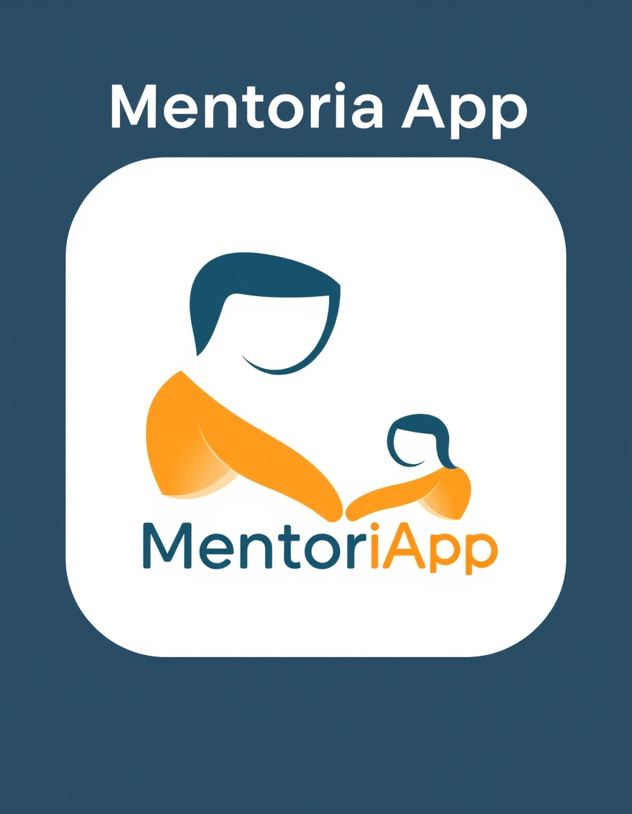
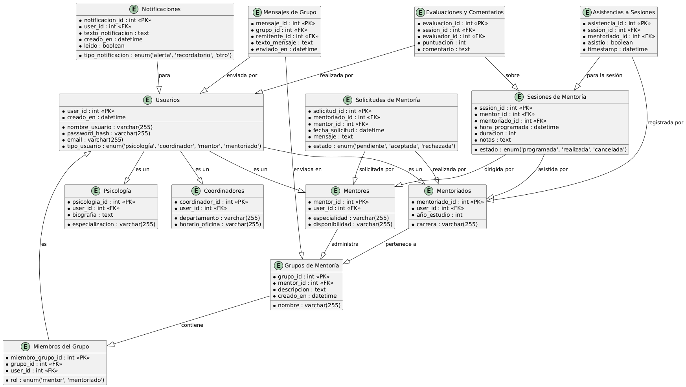

# CS2024-2Grupo01

## Autores

**Abel Luciano Aragon Alvaro**  
[aaragona@ulasalle.edu.pe](mailto:aaragona@ulasalle.edu.pe)

**Carlos Mijail Mamani Anccasi**  
[cmamania@ulasalle.edu.pe](mailto:cmamania@ulasalle.edu.pe)

---

## Problematica:

  El programa de **mentoría** en la **Universidad La Salle de Arequipa**, aunque beneficioso, enfrenta varios desafíos debido a la falta de un sistema automatizado para gestionar su funcionamiento. Actualmente, las tareas administrativas y de seguimiento se realizan de manera manual o con herramientas inadecuadas como Excel, lo que trae consigo una serie de principales problemas.

- Descoordinacion en la definición de horarios
- Muchos intermediarios para comunicar un evento u mensaje a la comunidad de mentoria.
- Llamado de asistencia manual y no tan fiable.
- Demora a la hora de definir manualmente la carga de mentoriados a cada mentor. 

## Proposito del proyecto:
Desarrollar una aplicación móvil que **automatice** la gestión del programa de mentoría, facilitando tanto el proceso organizativo como la participación de los estudiantes y mentores(administración y coordinadores). 

## Aplicaciones similares:

### 1. **MentorMe**
Una aplicación diseñada para conectar a estudiantes con mentores más avanzados o profesionales. Se enfoca en brindar apoyo académico y personal, ayudando a los estudiantes a mejorar en sus estudios y tomar decisiones informadas sobre su carrera. Los mentores pueden proporcionar orientación a los estudiantes en áreas específicas según sus necesidades.

### 2. **Scholarly**
Scholarly es una plataforma que ofrece un sistema de tutoría académica para estudiantes, permitiendo que aquellos en los primeros años de sus estudios se conecten con tutores o mentores más avanzados. El enfoque principal es la mejora académica, con una estructura simple que facilita la mentoría entre pares.

### 3. **Brightside**
Brightside está diseñada para ofrecer apoyo académico y personal a estudiantes de educación superior. Los mentores ayudan a los alumnos en temas de estudio y orientación, con el objetivo de fomentar el éxito académico y proporcionar un espacio de apoyo personalizado para quienes están comenzando sus estudios universitarios.

## Tegnologias a usar:

- **Entorno: Kotlin Multi Platform (Android Studio)**  
  

- **Base de Datos (SL): Firebase**  
  

- **Prototipo: Figma**  
  

- **Lenguaje: Kotlin**  
  

- **Repositorio: Git y GitHub**  
   

- **Base de Datos Relacional (por definir: MySQL o PostgreSQL)**  
  

- **Conexión Remota a Bases de Datos (Tecnología a definir)**  
--> GLIDE

---

<h1 align="center">MentoriaApp</h1>

  

## Enlace del Repositorio
[GitHub Repository](https://github.com/eluqm/CS2024-2Grupo01)

## Modelado de Base De Datos

  

## Fase: Análisis

### Requisitos y Funcionalidades Importantes

- **Tipos de Usuarios y Permisos:**
  - **Psicóloga:** Generar reportes y gestionar la data entrante.
  - **Coordinador:** Supervisar a los mentores mediante la observación de reportes.
  - **Mentor:** Registrar asistencia y adjuntar fotos y observaciones por cada sesión.
  - **Mentoreados:** Consultar horarios y notificaciones de mentoría.

- **Gestión de Cuentas:**
  - El sistema generará cuentas automáticamente tras validar y aceptar la carga de coordinadores, mentores y mentoreados.
  - Las credenciales serán: DNI y contraseña numérica (1 al 6), compartidas por email.

- **Preguntas de análisis:**
  - "¿Podríamos usar solo DNI para los mentoreados?"

- **Registro y Notificaciones:**
  - Registro automático de la hora y fecha de asistencia.
  - Los mentores deberán adjuntar fotografías y observaciones por cada sesión.
  - Emisión de eventos personalizados por el área de psicología, con inscripción opcional para mentoreados y mentores.
  - Notificaciones de mentores a mentoreados (texto solo) en un tablón/grupo de WhatsApp público.

- **Reportes y Estadísticas:**
  - Reportes automáticos de calificaciones de mentoreados, basados en asistencia y evaluación del mentor.
  - Reportes descargables en formato CSV para análisis externo.
  - Informe receptación de mentoreados y coordinadores, con opción de adjuntar documentos en la nube.

- **Configuración de Horarios:**
  - Los mentores podrán configurar su horario (1 sesión de 45 min por semana), visible para los mentoreados.

- **Carga de Datos:**
  - **Carga Masiva:**
    - Mentoreados: Carga semi-automática mediante CSVs por semestre.
    - Mentores y Coordinadores: Carga automática o manual (mediante email o formulario).

- **Encuestas:**
  - El sistema soporta encuestas de rendimiento para mentores y coordinadores.

## Fase: Casos de Uso

### 1. Login
- Actores: Todos.
- Idea: La primera vez que usuario inicie sesión puede ingresar mediante su DNI, el sistema valida si el DNI pertenece a la organización y si es asi le permite poner una contraseña de respaldo.

### 2. Carga Masiva:
- Actores: Psicología.
- DATA-USUARIOS: Se aplicara para el llenado de datos de los coodinadores, mentores y mentoriados. Se manejra por carrera, o sea en caso del CSV un CSV por carrera. O un SOLO CSV bien estructurado.
  - CSV: Se podra subir la data desde un CSV que previamente se proporcionara como platilla para que pueda ser leido.
  - Manual: Cuadros de textos para insertar los datos de una entidad en especifico.
-> Pregunta a la Psicologa como es que recibe los datos de los estudiantes cada inicio de semestre(formato, cantidas de archivos).

- DATA-AULAS: Una vez que la universidad le otorgue el permiso de ciertas **aulas** en ciertos **horarios** este podra ser subido mediante un CSV como un pull de aulas.
- La inserción podria ser manual, podria agregarse más o modificarse los ya existentes horarios.
- Se puede publicar para el uso de los mentoriados.

### 3. Creación y Reparto de grupos
- Actores: Coordinadores.
- Primero se selecciona a el mentor o a los mentores(dupla).
- Se puede poner un cantidad de mentoriados para asignar a este grupo, como por ejemplo 20.
- Te deberia dejar editar(quitar o agregar más)
- Listo.

### 4. Modificar grupos ya creados.
- Actores: Coordinadores.
- Una vez creado el grupo puede hacer correciones como.
  -  Quitar mentoriados de un grupo
  -  Cambiar de mentor a un grupo
  -  Agregar mentoriados a un grupo (trazladar mentoriados de un grupo a otro)
- El coodinador puede modificar los grupos a cada rato o cuando se plazca o tendria que haber ciertos parametros:
  -  Tiempo máximo para que pueda editar una vez guarda o modificada por ultima vez el grupo.
  -  Solicitud a Psicología para realizar cambios.

### 5. Gestión de Horario:
- Actores: Mentores.
- Selecciona un horario disponible. Se remite este horario a los mentoriados(notificaiones o que se publique en el tablon automaticamnte.).
- Puedes hacer cambio de horario. Solicitando permiso a Psicología o al coodinador, esperando un visto bueno.
- Tambien puedes dar una propuesta ingresando el dia, la hora y el aula. Seria enviado a Psicología.

### 6. Ver Tablon(chat grupal)
- Actores: Mentores y Mentoriados.
- Es como un chat cuaquiera pero publico y limitado:
  -  Solo texto
- Recibe los **eventos** publicados por Psicologia, los ancla como prioridad.

### 7. Gestión de Mentoriados Asignados
-  Selecciona a un mentoriado especifico y puedes exonerarlos del programa por razones ya estandarizadas:
  -  Separacion de matricula
  -  No desea participar
  -  Quiere participar en otro grupo.
- Esto los quita de la lista para que en la asitencia no esten apareciendo por las puras, esta modificacion se hace hasta antes de la segunda sesión. Posteriormente se tendria que solicitar a Psicologia o coordinadores.

### 8. Llamado Asistencia
- Actores: Mentoriados y mentores.
- Prerequisitos: Esta asitencia despues de haber quedado un horario solo puede ser ejecutado en ese horario.
- La sesion se enumera automaticamente, se solicita un nombre para la sesión que resuma de lo que va tratae esta.
- La asistencia del mentor se marca automaticamente.
- Llamado de asitencia de mentoriados:
  - Prederminadamente la asitencia es marcada para todos(o sea todos asistieron).
  - Se desmarca a los que no asistieron.
- Se pueden adjuntar links dentro de la descripción.
- Permite adjuntar una fotografia como parte de la evidencia y una breve descripción(opcional).
- Se registra la asistencia.
- En caso de registar asitencia a eventos la app reconocera automaticamnte la fecha y hora del evento y dejra tomar asitencia.
- **Data guardada**: Asistencia de ambos actores, fecha y hora, fotografia(f y h), titulo y la descripción. 
OJO: Como controlar el reparto de aulas.

### 9. Historial de sesiones:
- Actores: Mentores.
- En la cabecera se mostrara información:
  -  Cuantos mentoriados tiene asignado.
  -  Cuantos separaron matricula.
  -  Cuandos decidieron no participar.
  -  Número de sesiones dictadas.
  -  Promedio de mentoredos por sesion.
- Un listado de cada sesión mostrando:
  -  El número de sesión, nombre, cuantos asistieron, fecha y hora.

### 10. Ver horario y eventos:
- Acotores: Mentoriados y menotriados
- Podra ver su horario que fue publicado por el mentor.
- Podran ver los eventos publicados.

### 11. Gestion de eventos:
Actores: Psicología.
- Podra crear eventos a base de una plantilla que debe de llenar:
  - Nombre del evento:
  - Fecha y hora del evento:
  - Poster del evento
  - Descripción:
- Publicar para toda la comunidad.

### 12. Estadisticas de mentoria:
- General:
  - Número de participantes, decertores, separaron matricula.
  - Promedio de mentoriados que asisten a lo largo de la sesiones, hata la actualidad.
  - Se puede especificar por carrera.
- FLAGS:
  - Mentores que no tiene muchos mentoriados asitentes,
  - Mentores que no hacen sus sesiones
- *Se puede general graficos de sumo valor si es que se puede*

### 13. Evaluación categorica final.
- Es como un fomrulario para evaluar el redimiento de su superior.
- O sea de mentor a coodinador y de mentoriado a mentor.
- Esta evaluacion se activara cuando Psicología lo ve conveniente.

### 14. Historial de Asistencia(Mentoriado)
- Cada mentoriado podra ver su hsitorial asitencias.

### 15. Reportes finales.
- Permitira subir al mentor su informe final. Adjuntar el link de un PDF en todo caso.

### 16. Quejas y justificaiones.

## Fase: Diseño

- **Login**
  - Pantalla de inicio para cada tipo de usuario.
  - Pantalla de registro de asistencia (de mentor a mentoreados).

- **Tareas:**
  - Diseñar el logo de la aplicación.
  - Crear maquetas de:
    - Pantalla de inicio de cada usuario.
    - Pantalla de registro de asistencia (de mentor a mentoreados).